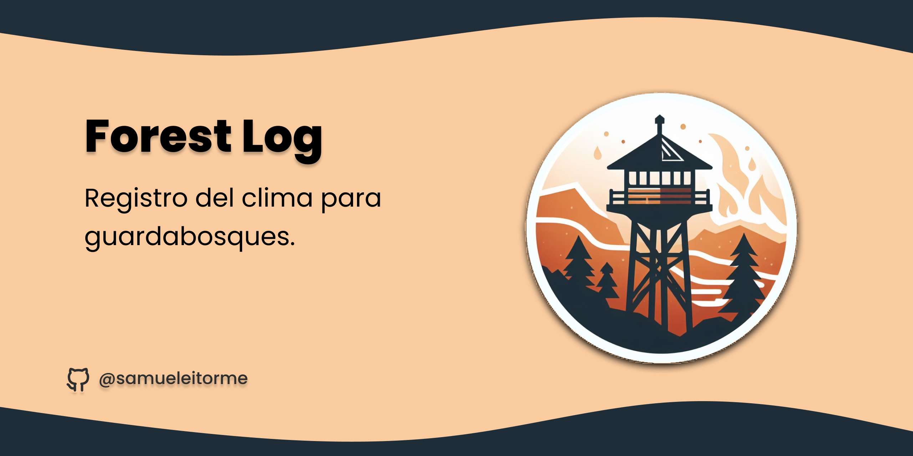

# Forest Log
> [!IMPORTANT]
> Este proyecto sigue en desarrollo.



Es una aplicación simple, creada con flask, plantillas y una base de datos SQLite. Respecto a la funcionalidad, puedes consultar el historial de registros y añadir nuevos registros.


## Instalación 

1. Clona el respositorio. 
   ```bash
   git clone https://github.com/samueleitorme/forestlog.git
   ```
2. Instala las dependencias.

   ```python
   pip -r forestlog/requitements.txt
   ```
3. Ejecuta la aplicación.
   ```bash
   python forestlog/app/app.py
   ```

## Funcionalidades

- **Registro de datos**: Los guardabosques pueden registrar datos relacionados con la temperatura, velocidad del viento, tiempo, excursionistas ayudados y el nombre del guarda.

- **Historial de registros**: La aplicación muestra todos los registros en una tabla, lo que facilita la consulta de los datos previamente registrados.
